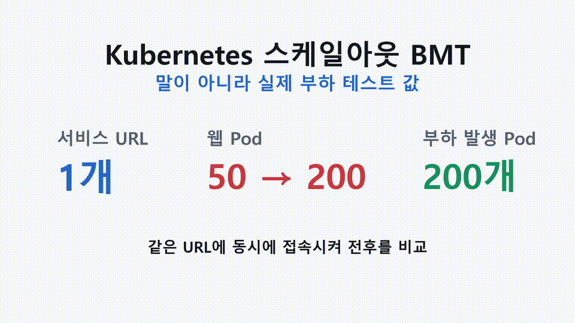

# VKE Scale-out BMT

Vultr Kubernetes Engine(VKE)에서 부하 발생 시 스케일아웃 효과를 검증하는 공개용 BMT 스크립트입니다.

<p align="center">
  <a href="media/vke-scaleout-bmt-demo.mp4">
    
  </a>
</p>

> 이 프로젝트는 k3s가 아니라 **Vultr에서 제공하는 Kubernetes 서비스(VKE)** 를 사용합니다. 갑자기 부하가 걸릴 때, 하나의 서비스 URL 뒤에서 처리 Pod를 빠르게 늘려 대응할 수 있는 체계를 실측값으로 확인하는 것이 목적입니다.

핵심 시나리오는 단순합니다.

1. 하나의 Kubernetes Service URL 뒤에 nginx 웹 Pod 50개를 붙입니다.
2. 부하 발생용 Pod 200개를 가상 고객처럼 만들어 같은 URL에 동시에 접속시킵니다.
3. 부하 상태를 측정한 뒤, 웹 Pod를 50개에서 200개로 4배 스케일아웃합니다.
4. 같은 부하를 다시 걸어 성공률, 오류 수, 응답시간이 개선되는지 비교합니다.
5. 테스트가 끝나면 VKE 클러스터와 worker 리소스를 삭제합니다.

## 이 프로젝트가 보여주는 것

이 프로젝트는 "Pod를 많이 만들 수 있다"를 보여주려는 것이 아닙니다.

접속자가 몰렸을 때 Kubernetes가 처리 Pod를 늘려 서비스 오류와 응답 지연을 줄일 수 있는지, 작은 비용으로 직접 실측하는 예제입니다.

## 실측 결과

이번 공개 예시는 VKE worker 4개 위에서 nginx 웹 Pod를 50개에서 200개로 늘리고, 별도 부하 발생 Pod 200개가 같은 Service URL에 접속하도록 만든 BMT입니다.

| 구분 | Web Pod | Loadgen Pod | 총 요청 수 | 성공률 | 오류 수 | 평균 응답 | p95 응답 |
|---|---:|---:|---:|---:|---:|---:|---:|
| 확장 전 | 50 | 200 | 4,305 | 85.8% | 610 | 569.0ms | 3000.0ms |
| 확장 후 | 200 | 200 | 4,175 | 91.6% | 350 | 368.6ms | 2473.1ms |

여기서 **총 요청 수**는 초당 요청 수(RPS)가 아닙니다. 부하 테스트 1회가 끝날 때까지 부하 발생 Pod들이 보낸 전체 요청 시도 수입니다.

예를 들면 확장 전에는 전체 4,305번 요청 중 3,695번이 HTTP 200으로 성공했고, 610번은 실패 또는 타임아웃으로 집계됐습니다. 그래서 성공률이 85.8%입니다.

원본 로그와 보고서:

- [한글 실측 보고서](runs/loadgen200_20260620152106/report_final_ko.md)
- [확장 전 metric](runs/loadgen200_20260620152106/metric-before2.txt)
- [확장 후 metric](runs/loadgen200_20260620152106/metric-after2.txt)
- [확장 전 부하 로그](runs/loadgen200_20260620152106/load-before2.all.log)
- [확장 후 부하 로그](runs/loadgen200_20260620152106/load-after2.all.log)
- [실행 로그](runs/loadgen200_20260620152106/driver.log)
- [정리 확인 로그](runs/loadgen200_20260620152106/leftovers_final_checked.txt)

## 주의

- 이 스크립트는 실제 Vultr 리소스를 생성합니다.
- 2026-06-20 확인 기준 Vultr 공식 문서에 따르면 VKE control plane 자체는 별도 비용이 없지만, worker node, load balancer, block storage 같은 provisioned resource는 과금됩니다.
- 기본값은 `vc2-1c-2gb` worker node 4개입니다.
- worker node는 선택한 instance type과 연결 리소스의 hourly 또는 monthly rate에 따라 과금될 수 있습니다.
- 실행 전 반드시 비용과 리소스 limit을 확인하세요.
- 실행 중 오류가 나도 `cleanup`을 다시 실행해서 남은 리소스를 확인하세요.

공식 참고:

- VKE 비용: https://docs.vultr.com/support/products/vke/how-much-does-the-vultr-kubernetes-engine-cost
- Server billing: https://docs.vultr.com/support/platform/billing/how-am-i-billed-for-my-servers

## 준비물

- Vultr API token
- `bash`, `curl`, `jq`
- `kubectl`은 없으면 실행 중 임시로 다운로드합니다.

## 실행

```bash
export VULTR_API_KEY="<token>"
export ALLOW_COSTLY_BMT=1

./scripts/vke-scaleout-bmt.sh run
```

기본값:

```bash
REGION=icn
PLAN=vc2-1c-2gb
NODES=4
INITIAL_REPLICAS=50
FINAL_REPLICAS=200
LOADGEN_PODS=200
REQUESTS_PER_LOADGEN=20
```

값을 바꾸려면 환경변수로 지정합니다.

```bash
REGION=icn \
NODES=4 \
INITIAL_REPLICAS=50 \
FINAL_REPLICAS=200 \
LOADGEN_PODS=200 \
REQUESTS_PER_LOADGEN=20 \
ALLOW_COSTLY_BMT=1 \
VULTR_API_KEY="<token>" \
./scripts/vke-scaleout-bmt.sh run
```

## 정리

실행이 중간에 멈췄다면 같은 `RUN_ID` 또는 `LABEL`을 지정해서 정리하세요.

```bash
export VULTR_API_KEY="<token>"
export ALLOW_COSTLY_BMT=1
export RUN_ID="실행했던_RUN_ID"

./scripts/vke-scaleout-bmt.sh cleanup
```

남은 리소스 확인:

```bash
./scripts/vke-scaleout-bmt.sh verify-cleanup
```

## 산출물

실행 결과는 `runs/<RUN_ID>/` 아래에 저장됩니다.

- `report.txt`: 전후 비교 리포트
- `metric-before.txt`: 50개 웹 Pod 상태에서의 부하 결과
- `metric-after.txt`: 200개 웹 Pod 상태에서의 부하 결과
- `driver.log`: 실행 로그
- `leftovers.txt`: cleanup 후 남은 리소스 확인 결과

`runs/` 폴더는 `.gitignore`에 포함되어 있습니다.

단, 공개 검증용 샘플 실행 `runs/loadgen200_20260620152106/`은 실측 근거를 남기기 위해 저장소에 포함했습니다.

## 정확한 표현

이 프로젝트는 k3s가 아니라 **Vultr Kubernetes Engine 기반 Kubernetes BMT**입니다.

그리고 기본 스크립트는 HPA/KEDA 자동 확장 예제가 아니라, 수동 스케일아웃 전후 비교 BMT입니다. 자동 확장까지 검증하려면 metrics-server, HPA 또는 KEDA 구성을 추가해야 합니다.

## License

MIT
